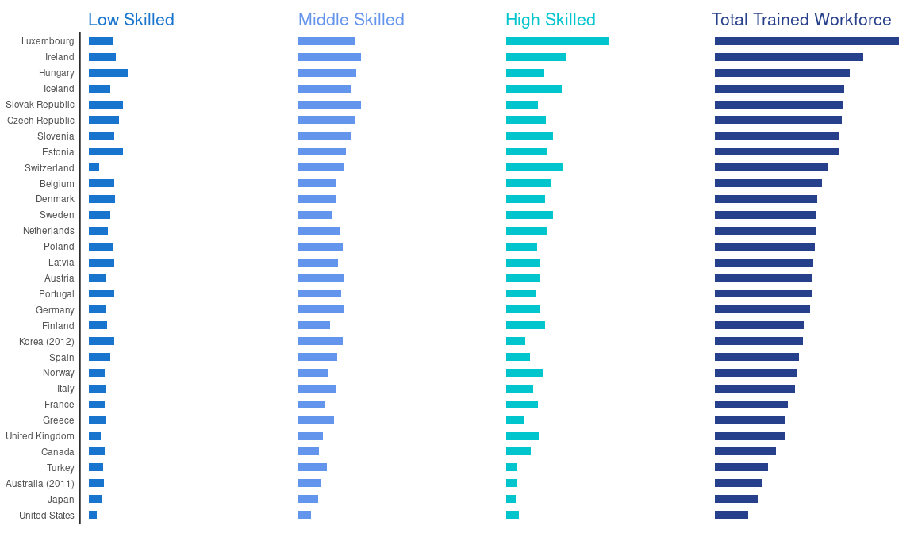
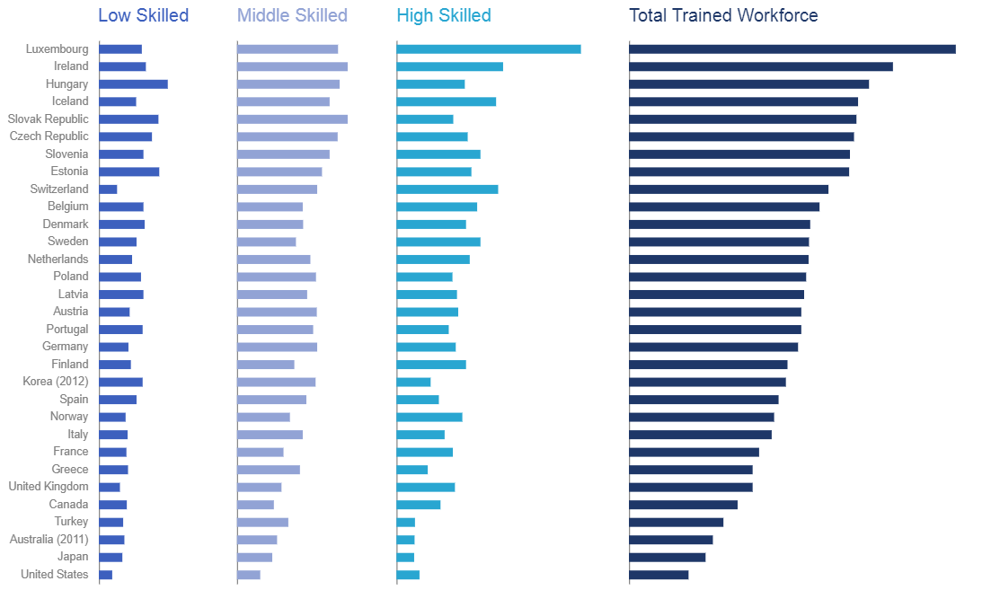
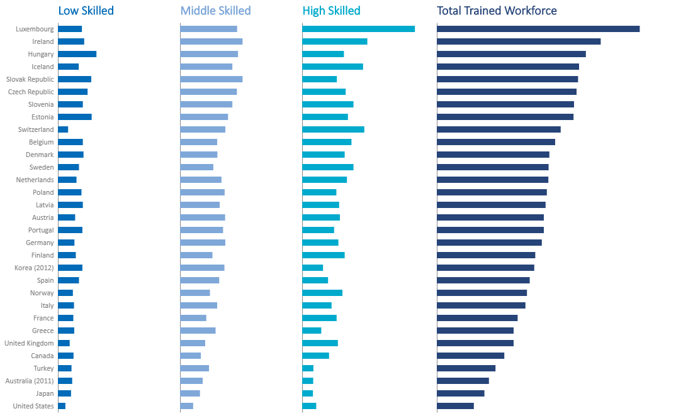
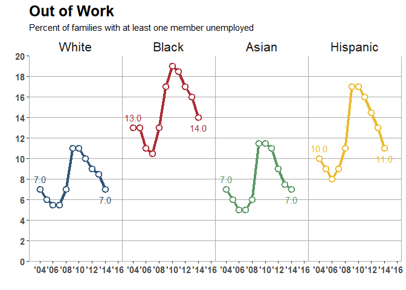
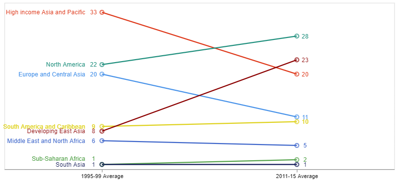
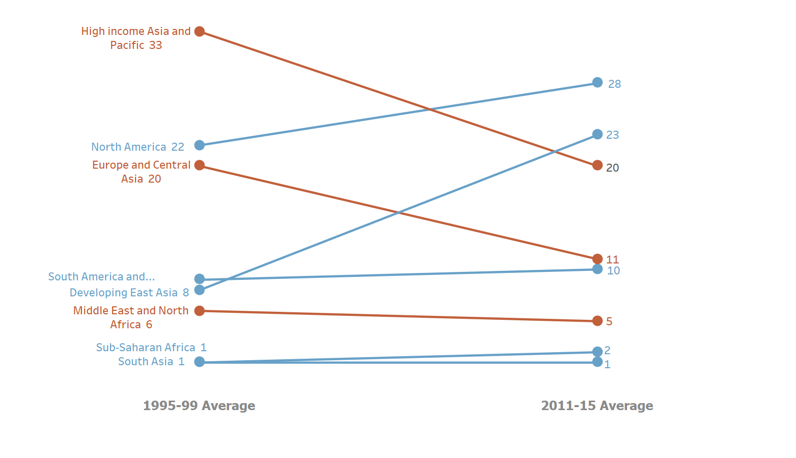

# Homework 4: Re-create Charts

Examples of excellent chart recreations from [HW4](https://github.com/cs625-datavis-fall20/assignments/blob/master/HW4.md)

## Chart 1
Original chart: 

**R** ([source and explanation](line-R-Dalina.md)) - Dalina:

**Tableau** ([explanation](line-Tableau-Heramb.md)) - Heramb:

## Chart 2
Original chart: 

**R** ([source and explanation](bar-multiples-R-Abigail.md)) - Abigail:

**R** ([source](bar-multiples-R-Spiros.md)) - Spiros:

**Vega-Lite** ([source and explanation](bar-multiples-VegaLite-Dalina.md)) - Dalina:

**Vega-Lite** ([source and explanation](bar-multiples-VegaLite-Heramb.md)) - Heramb:

## Chart 3
Original chart: 

**R** ([source and explanation](line-multiples-R-Caroline.md) - Caroline:

## Chart 4
Original chart: 

**Vega-Lite** ([source and explanation](slope-VegaLite-Trupti.md)) - Trupti:

Original chart:

**Tableau** ([explanation](slope-Tableau-Caroline.md)) - Caroline:

