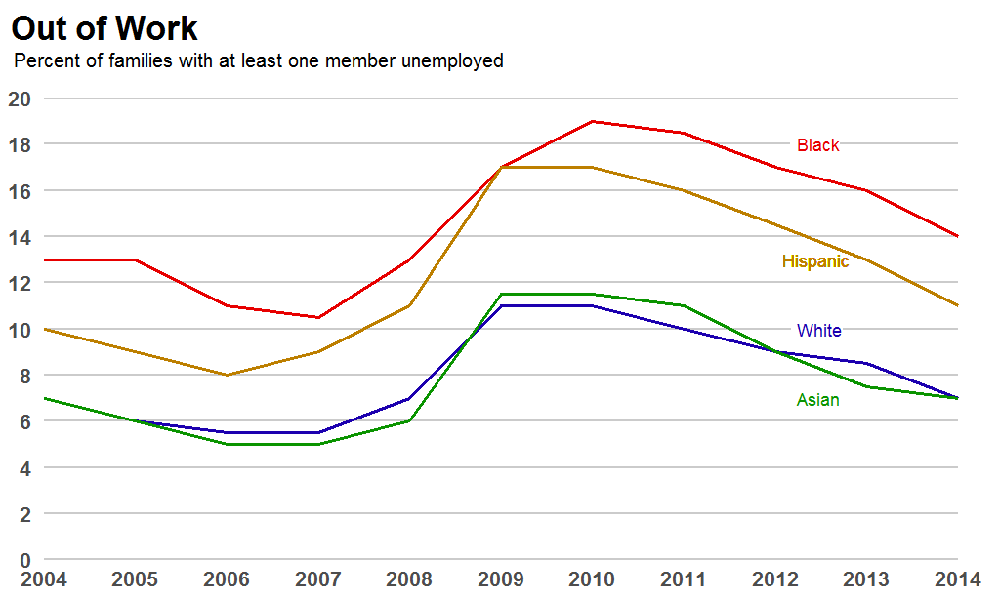
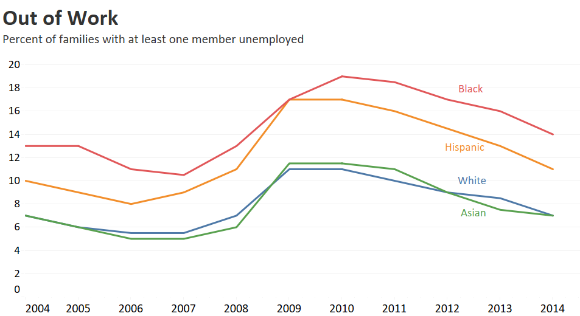

# Homework 4: Re-create Charts

Examples of excellent chart recreations from [HW4](https://github.com/cs625-datavis-fall20/assignments/blob/master/HW4.md)

## Chart 1

Original chart: 

R ([source and explanation](line-R-Dalina.md)) - Dalina:

Tableau ([explanation](line-Tableau-Heramb.md)) - Heramb:

https://policyviz.com/wp-content/uploads/2017/11/PolicyViz_OECDStackedColumnChartRemake.png
* Vega-Lite - Dalina
https://github.com/cs625-datavis-fall20/hw4-recreate-dgitty/blob/master/p2_recreate.png
* Vega-Lite - Heramb
https://github.com/cs625-datavis-fall20/hw4-recreate-Heramb001/blob/master/images/part-2-b-vegalite.png
* R - Abigail
https://github.com/cs625-datavis-fall20/hw4-recreate-a-mabe/blob/master/report_files/figure-markdown_strict/unnamed-chunk-1-1.png
* R - Spiros
https://github.com/cs625-datavis-fall20/hw4-recreate-spyridon97/blob/master/report_files/figure-gfm/unnamed-chunk-1-1.png

https://policyviz.com/wp-content/uploads/2018/02/PolicyViz_WSJ_Remake_SmallMultiples-1024x615.png
* R - Caroline
https://github.com/cs625-datavis-fall20/hw4-recreate-cgran010/blob/master/Report_files/figure-gfm/unnamed-chunk-2-1.png

https://policyviz.com/wp-content/uploads/2018/02/PolicyViz_USDARemake_SlopeChart_RedBlue-600x359.png
* Tableau - Caroline
https://github.com/cs625-datavis-fall20/hw4-recreate-cgran010/blob/master/Part%202%20Tableau.png
* Vega-Lite - Trupti
https://github.com/cs625-datavis-fall20/hw4-recreate-TruptiVaity/blob/master/report_files/figure-gfm/slope_chart.png

